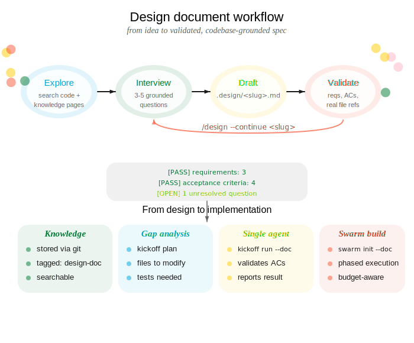

::: {.guide-card}
{.card-icon}

## tl;dr

The `/design` flow turns a rough feature idea into a validated, codebase-grounded design document through interactive iteration. The output feeds directly into `/kickoff` and `crosslink swarm` for implementation.
:::

&nbsp;

## Overview

To start a design session, ask your agent:

```bash
/design "add batch retry logic for sync"
```

This triggers the conversational design document workflow.

::: {.column-screen .center}
{width="850px"}
:::

## Starting a design

::: {.columns}
::: {.column width="35%"}
**You say:**

> "Design the batch retry logic for sync"

Describe the feature in natural language. Optionally reference an existing crosslink or GitHub issue.
:::
::: {.column width="5%"}
→
:::
::: {.column width="60%"}
**Your agent runs:**

```bash
/design "add batch retry logic for sync"

# Or grounded in an existing issue:
/design --issue 42
/design --gh-issue 178
```

The agent explores the codebase and asks 3-5 clarifying questions before writing anything.
:::
:::

&nbsp;

---

## Design workflow

### *Phase 1:* Explore and Interview

The agent reads architecture files, searches for related code, checks existing knowledge pages, and scans `.design/` for prior work. Then it asks questions grounded in what it found — every question references specific files, functions, or patterns from the codebase.

```
Agent: I found these relevant modules:
  - src/sync/mod.rs — current sync pipeline, no retry logic
  - src/sync/error.rs — SyncError enum with 6 variants
  - src/queue/batch.rs — BatchProcessor with configurable concurrency

Questions:
  1. Should retries apply to all SyncError variants, or only
     transient ones (NetworkTimeout, RateLimit)?
  2. BatchProcessor already has a max_concurrency field — should
     retry backoff reduce concurrency, or just delay?
  3. What's the upper bound on retries before we escalate to
     the dead-letter queue in src/queue/dlq.rs?
```

Answer the questions and the agent proceeds to drafting.


### *Phase 2:* Draft

::: {.columns}
::: {.column width="35%"}
**You answer the questions:**

> "Only transient errors. Back off with jitter, don't reduce concurrency. Max 5 retries, then DLQ."
:::
::: {.column width="5%"}
→
:::
::: {.column width="60%"}
**Your agent produces:**

```
.design/add-batch-retry-logic.md
```

A structured document with:

- **Requirements** — grounded in real codebase concepts
- **Acceptance criteria** — mechanically testable
- **Architecture** — references actual file paths
- **Open questions** — genuine ambiguities, not guesses
- **Out of scope** — explicit exclusions
:::
:::

### Document structure

```markdown
# Feature: Add batch retry logic

## Summary
Add exponential backoff with jitter for transient
sync errors in the batch processor pipeline.

## Requirements
- REQ-1: Retry only transient SyncError variants
  (NetworkTimeout, RateLimit) up to 5 attempts
- REQ-2: Use exponential backoff with jitter
  between retries
- REQ-3: Route permanently failed items to the
  dead-letter queue after exhausting retries

## Acceptance Criteria
- [ ] AC-1: NetworkTimeout errors retry up to 5 times
      with increasing delay
- [ ] AC-2: Non-transient errors (InvalidPayload,
      AuthFailure) fail immediately without retry
- [ ] AC-3: Items exceeding max retries appear in
      DLQ with original error context

## Architecture
Modify `src/sync/mod.rs` to wrap the existing
`process_batch()` call in a retry loop...

## Open Questions

<!-- OPEN: Q1 -->
### Q1: Metrics and observability
Should retry counts be exposed via the existing
metrics in `src/telemetry/mod.rs`?
<!-- /OPEN -->

## Out of Scope
- Circuit breaker pattern (separate feature)
- Retry configuration via runtime config file
```

### Validation

After writing the document, the agent runs automatic validation:

```
Design doc validation:
  [PASS] Summary present
  [PASS] Requirements: 3 items
  [PASS] Acceptance Criteria: 3 items
  [PASS] Architecture references real files
  [PASS] No placeholder text
  [OPEN] 1 unresolved open question remains
```

&nbsp;

---

## Phase 3: Iterate

::: {.columns}
::: {.column width="35%"}
**You say:**

> "Yes, add metrics. And also handle partial batch failures."

You can edit the document directly in your editor, resolve open questions by removing the `<!-- OPEN -->` markers, or tell your agent to continue iterating.
:::
::: {.column width="5%"}
→
:::
::: {.column width="60%"}
**Your agent runs:**

```bash
/design --continue add-batch-retry-logic
```

The agent detects which open questions you resolved, re-explores the codebase if scope changed, updates requirements and acceptance criteria, and writes the updated document.
:::
:::

Each iteration strengthens the document:

- Resolved questions become concrete requirements
- New scope additions get new acceptance criteria
- Architecture references are updated if new files are involved
- New ambiguities surface as `<!-- OPEN -->` blocks

&nbsp;

---

## From design to implementation

Once the design document has no unresolved open questions, it's ready to drive implementation.

### Gap analysis

Before launching an agent, run a read-only gap analysis:

```bash
crosslink kickoff plan .design/add-batch-retry-logic.md
```

This compares the design against the current codebase and reports:

- Which files need modification
- Which acceptance criteria can be verified by existing tests
- Which new tests are needed
- Estimated scope and complexity

### Single agent

Launch one agent to implement the entire feature:

```bash
crosslink kickoff run "add batch retry logic" \
  --doc .design/add-batch-retry-logic.md
```

The agent receives the full design document as context and implements against the requirements and acceptance criteria. See [Kickoff](kickoff.qmd).

### Multi-agent swarm

For larger designs, initialize a swarm that coordinates multiple agents across phases:

```bash
crosslink swarm init \
  --doc .design/add-batch-retry-logic.md
crosslink swarm launch 1
```

The swarm planner splits the design into phases with dependency ordering, budget windows, and phase gates. See [Swarm Orchestration](swarm.qmd).

&nbsp;

---

## Knowledge integration

Design documents are automatically stored as crosslink knowledge pages after validation:

```bash
crosslink knowledge add "add-batch-retry-logic" \
  --from-doc .design/add-batch-retry-logic.md \
  --tag design-doc
```

This makes the design searchable by all agents via `crosslink knowledge search`. If the design was started from a crosslink issue, a plan comment is also recorded on the issue.

&nbsp;

---

## Quality standards

The `/design` skill enforces these standards on every document:

- Requirements reference real codebase concepts, not generic statements
- Acceptance criteria are mechanically testable (a CI system could verify them)
- Architecture references actual file paths verified against the working tree
- No placeholder text (`<...>`, `TODO`, `TBD`)
- Every requirement maps to at least one acceptance criterion
- Genuine ambiguities become open question blocks, not guesses
