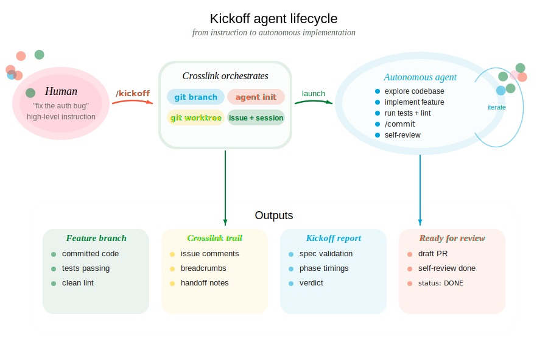

::: {.guide-card}
{.card-icon}

## tl;dr

The `/kickoff` flow launches an autonomous Claude agent in an isolated git worktree to implement a feature in the background. You describe what you want, and a fully instrumented agent handles the rest -- tracked through crosslink the entire way.
:::

&nbsp;

## Overview

To start a new parallel feature agent, ask your agent:

```bash
/kickoff "github issue #37"
```

or, from the CLI, use `crosslink kickoff run` for a task description:

```bash
crosslink kickoff run "add batch retry logic"
```

or a [design document](design-workflow.qmd):

```bash
crosslink kickoff run --doc .design/batch-retry-logic.md
```

::: {.column-screen .center}
{width="900px"}
:::

## Usage

::: {.columns}
::: {.column width="35%"}
**You say / do:**

> "Build batch retry logic for the job queue."

You describe the feature in natural language. Optionally specify a verification level.
:::
::: {.column width="5%"}
→
:::
::: {.column width="60%"}
**Agent executes:**

```bash
crosslink kickoff run "add batch retry logic"
```

Creates branch, worktree, agent identity, prompt, and launches a background tmux session.
:::
:::

::: {.columns}
::: {.column width="35%"}
**You say / do:**

> "Build it and make sure CI passes before you call it done."

Adding verification means the agent will push, open a draft PR, and iterate until CI is green.
:::
::: {.column width="5%"}
→
:::
::: {.column width="60%"}
**Agent executes:**

```bash
crosslink kickoff run "add batch retry logic" \
  --verify ci
```
:::
:::

::: {.columns}
::: {.column width="35%"}
**You say / do:**

> "Build it, get CI green, and do a thorough self-review before finishing."

The agent runs CI plus an adversarial review pass -- checking for debug code, TODOs, and incomplete error handling.
:::
::: {.column width="5%"}
→
:::
::: {.column width="60%"}
**Agent executes:**

```bash
crosslink kickoff run "add batch retry logic" \
  --verify thorough
```
:::
:::

&nbsp;

---

## What happens step by step

### 1. Feature branch

A branch is created from the current HEAD using the `/feature` skill:

```
"add batch retry logic" -> feature/add-batch-retry-logic
```

A crosslink issue is created and labeled `feature` to track the work.

### 2. Git worktree

The `/featree` skill creates an isolated worktree at `.worktrees/<slug>/` so the agent works on a separate copy of the repo. Your main working directory is untouched.

Inside the worktree, crosslink is initialized with a unique agent identity (e.g., `m1--add-batch-retry-logic`) so multi-agent lock coordination works.

### 3. Tool detection

Kickoff scans the project for build and test tooling and auto-configures which shell commands the agent is allowed to run:

| Detected File | Tools Allowed |
|---------------|---------------|
| `Cargo.toml` | `cargo test`, `cargo clippy`, `cargo fmt` |
| `package.json` | `npm test`, `npm run`, `npx` |
| `pyproject.toml` | `uv run pytest`, `pytest` |
| `justfile` | `just` |
| `Makefile` | `make` |

Read-only git commands and crosslink commands are always allowed. Git mutations (push, commit, merge) are gated by crosslink hooks.

### 4. Agent prompt (KICKOFF.md)

A comprehensive prompt is written to `KICKOFF.md` in the worktree. It includes:

- The feature description and any file/module references you provided
- Full crosslink workflow instructions (session start, work tracking, breadcrumbs)
- Project-specific test and lint commands
- A self-review checklist
- The verification level and CI instructions (if applicable)

This file is git-excluded so it doesn't end up in commits.

### 5. tmux session

A detached tmux session is created and `claude` is launched inside it with the `KICKOFF.md` prompt and pre-approved tool permissions.

```
Feature agent launched.

  Worktree: .worktrees/add-batch-retry-logic
  Branch:   feature/add-batch-retry-logic
  Session:  feat-add-batch-retry-logic

  Approve trust:   tmux attach -t feat-add-batch-retry-logic
  Check status:    /check feat-add-batch-retry-logic
```

**Important:** The agent waits for you to approve trust before it begins. Attach to the tmux session and approve the initial prompt.

### 6. Implementation script

Once trust is approved, the background agent:

1. Starts a crosslink session and marks the feature issue as its focus
2. Reads `CLAUDE.md` and explores relevant code
3. Documents its plan via `crosslink issue comment`
4. Implements the feature (no stubs, full error handling)
5. Records breadcrumbs with `crosslink session action` to survive context compression
6. Runs tests and linters
7. Commits with `/commit` (which also documents the commit on the crosslink issue)
8. Performs self-review against a checklist
9. Writes `DONE` to `.kickoff-status` when finished
10. Ends the crosslink session with handoff notes

&nbsp;

---

## Controlled agent execution

### Verification levels

#### `--verify local` (default)

The agent runs the project's test suite and linter locally. No network operations.

### `--verify ci`

After local tests pass, the agent also:

1. Pushes the branch to `origin`
2. Opens a draft pull request via `gh pr create --draft`
3. Polls CI status every 30 seconds via `gh run list`
4. If CI fails: reads logs with `gh run view --log-failed`, fixes issues, re-pushes
5. Retries up to 5 times before giving up

### `--verify thorough`

Everything from `--verify ci`, plus an adversarial self-review:

- Checks for debug code (`dbg!`, `console.log`, `println!`, `TODO`, `FIXME`)
- Checks for commented-out code and unintended file changes
- Verifies commit messages are clean and changes match the feature description
- Verifies complete error handling and no new warnings
- Fixes any issues found and pushes again

### Safety constraints

The background agent operates under the same crosslink hook enforcement as interactive sessions:

- **Always blocked:** `git push`, `git merge`, `git rebase`, `git reset`, and other destructive git commands (except when CI verification is enabled, where push is allowed)
- **Gated on active issue:** `git commit` requires an active crosslink work item
- **Tool auto-approval:** Only pre-approved tools run without prompting; anything else pauses the agent
- **Isolated worktree:** All changes are confined to `.worktrees/` -- your main checkout is untouched
- **Full audit trail:** Every decision, discovery, and intervention is logged on the crosslink issue

&nbsp;

### Configuring agent permissions

Agent permissions live in the **agent config file** -- `.claude/settings.json` in the worktree, written by `crosslink init` from crosslink's template. They are *not* configured through any `crosslink config` key. There are two levers, and they answer different questions:

- **Persistent policy (`.claude/settings.json`)** -- the `allowedTools` array (and Claude Code's `permissions.allow` / `permissions.deny` blocks) decide which tools the agent may run without prompting on *every* run. Edit this file to teach a repo "agents may always run `npm test`" or "agents may never run `curl`". Crosslink's `init` merges its defaults with whatever the file already contains, so hand-edits are preserved across `init --force`.
- **Per-invocation override (`--skip-permissions`)** -- the `crosslink kickoff run --skip-permissions` flag passes `--dangerously-skip-permissions` to the Claude CLI for that single launch, bypassing *all* prompts. It is a one-shot dial, not a setting. Reach for it when you have decided the surrounding environment (sandbox, container, isolated worktree, hook policy) makes the agent's blast radius acceptable. Do not reach for it as a substitute for configuring `allowedTools`.

If you find yourself passing `--skip-permissions` on every kickoff, that's a signal to add the relevant tool patterns to `allowedTools` in `.claude/settings.json` instead -- agents will then run unattended for the allowed surface without giving up the prompt for everything else. See [Claude Code's settings reference](https://docs.claude.com/en/docs/claude-code/settings) for the full schema of `allowedTools` and `permissions`.

&nbsp;

---

## Managing kickoffs

### Monitoring with `/check`

While the agent works, use `/check` to monitor progress:

```bash
# Check a specific session
/check feat-add-batch-retry-logic

# Check all feature sessions in this repo
/check
```

`/check` reads the tmux pane, the `.kickoff-status` sentinel file, and crosslink issue state to report whether the agent is working, waiting for input, errored, or done.

### Listing active agents

See which agents are currently running across all execution backends:

::: {.columns}
::: {.column width="35%"}
**You say / do:**

> "What agents are running right now?"

You want a quick view of all active agents -- whether they are in worktrees, tmux sessions, or Docker containers.
:::
::: {.column width="5%"}
→
:::
::: {.column width="60%"}
**Agent executes:**

```bash
crosslink kickoff list
```

Output includes agent name, worktree path, branch, backend (tmux/docker), uptime, and current status.
:::
:::

### Cleaning up

After reviewing the agent's work, clean up the worktree and session infrastructure.

::: {.columns}
::: {.column width="35%"}
**You say / do:**

> "Clean up all the finished agents."

You want to remove worktrees, tmux sessions, and containers for agents that are done.
:::
::: {.column width="5%"}
→
:::
::: {.column width="60%"}
**Agent executes:**

```bash
crosslink kickoff cleanup
```

Prunes stale worktrees, terminates dead tmux sessions, and removes stopped Docker containers. Only cleans up agents whose `.kickoff-status` is `DONE` or whose processes are no longer running.
:::
:::

### Running multiple agents

You can launch multiple kickoff agents simultaneously on different features. Each gets its own worktree, branch, crosslink agent identity, and tmux session. Lock coordination via the `crosslink/hub` branch prevents two agents from working on the same issue.

```bash
/kickoff "add batch retry logic"
/kickoff "refactor config parser"
/kickoff "fix auth token refresh" --verify ci

# Monitor all at once
/check
```

See [Multi-Agent Coordination](multi-agent.qmd) for details on distributed locking.
