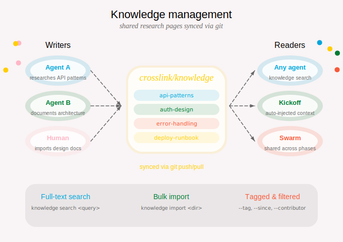

::: {.guide-card}
{.card-icon}

## tl;dr

Crosslink's knowledge system is shared memory for your agents. When one agent researches an API, evaluates a library, or documents an architectural decision, that knowledge is automatically available to every other agent working on the project. Knowledge pages live on a dedicated `crosslink/knowledge` git branch (separate from your code) and sync automatically when agents start sessions.
:::

&nbsp;

::: {.column-screen .center}
{width="850px"}
:::

&nbsp;

## How agents use knowledge

::: {.columns}
::: {.column width="35%"}
**You say:**

> "Research the best approach for rate limiting"

The agent investigates, then saves its findings as a knowledge page — tagged, sourced, and searchable.
:::
::: {.column width="5%"}
→
:::
::: {.column width="60%"}
**Agent executes:**

```bash
crosslink knowledge add rate-limiting \
  --title "Rate Limiting Strategy" \
  --tag architecture --tag performance \
  --source "https://example.com/rate-limits" \
  --content "After evaluating token bucket vs \
  sliding window..."
```
:::
:::

Later, when another agent starts a session on a related issue, the `session-start` hook and knowledge MCP server automatically surface relevant pages. Research done once benefits every agent.

### Creating pages

::: {.columns}
::: {.column width="35%"}
**You say:**

> "Save that auth research to knowledge"

Agents create pages with descriptive slugs, tags for discoverability, and source links for provenance.
:::
::: {.column width="5%"}
→
:::
::: {.column width="60%"}
**Agent executes:**

```bash
# Basic page
crosslink knowledge add api-auth \
  --title "API Authentication Patterns" \
  --content "Findings from investigating..."

# With tags and sources
crosslink knowledge add api-auth \
  --tag security --tag architecture \
  --source "https://docs.example.com/auth"

# Import from a design document
crosslink knowledge add auth-design \
  --from-doc .design/auth-system.md
```
:::
:::

### Browsing and searching

::: {.columns}
::: {.column width="35%"}
**You ask:**

> "What do we know about caching?"

The agent searches across all knowledge pages with full-text search, filtering by tags, contributors, or date range.
:::
::: {.column width="5%"}
→
:::
::: {.column width="60%"}
**Agent executes:**

```bash
crosslink knowledge search "caching" --context 3
crosslink knowledge search "oauth" --tag security
crosslink knowledge list --tag architecture
crosslink knowledge show api-auth
```
:::
:::

You can also browse knowledge visually through the [TUI](tui.qmd) (Knowledge tab) or [Web Dashboard](web-dashboard.qmd).

### Editing pages

Your agents have a detailed surface to update knowledge as the project evolves.

#### Append and replace

```bash
# Append a new finding
crosslink knowledge edit rate-limiting \
  --append "Update: switched to sliding window after load testing"

# Replace all content
crosslink knowledge edit rate-limiting \
  --content "Completely revised strategy..."

# Add more tags or sources
crosslink knowledge edit rate-limiting \
  --tag load-testing --source "https://example.com/new-ref"
```

#### Section-based editing (v0.5.0)

For surgical updates to specific parts of a page:

```bash
# Replace an entire section by heading
crosslink knowledge edit api-auth \
  --replace-section "Token Refresh" \
  --content "New approach: use rotating refresh tokens..."

# Append to a specific section
crosslink knowledge edit api-auth \
  --append-to-section "Open Questions" \
  --content "- How do we handle token revocation at scale?"
```

This is especially useful when agents update knowledge incrementally — adding findings to the right section without disturbing the rest of the page.

### Syncing and conflict resolution

Knowledge syncs automatically during `crosslink session start` and `crosslink sync`. When two agents edit the same page concurrently, crosslink uses an **accept-both** merge strategy: both versions are preserved with clear markers, so no work is lost.

&nbsp;

---

## Bulk import

Import existing documentation into the knowledge base:

```bash
crosslink knowledge import ./docs/research/
crosslink knowledge import ./docs/ --tag imported --overwrite
crosslink knowledge import ./notes/ --dry-run  # preview without writing
```

&nbsp;

---

## Tips

- **Save research as you go.** When an agent reads API docs, evaluates libraries, or investigates a bug, it should save findings to knowledge so other agents benefit.
- **Use descriptive slugs.** `api-auth-patterns` is better than `research-1`.
- **Tag consistently.** Use tags like `architecture`, `security`, `performance`, `debugging`, `api`, `dependency` to make pages discoverable.
- **Include sources.** Link to the original documentation, blog post, or discussion that informed the page.

<!-- &nbsp;

---

## Quick reference

| Command | Description |
|---------|-------------|
| `knowledge add <slug>` | Create a new page |
| `knowledge show <slug>` | Display a page |
| `knowledge list` | List all pages |
| `knowledge edit <slug>` | Update a page |
| `knowledge edit <slug> --replace-section <heading>` | Replace a section |
| `knowledge edit <slug> --append-to-section <heading>` | Append to a section |
| `knowledge remove <slug>` | Remove a page |
| `knowledge sync` | Manually sync from remote |
| `knowledge search <query>` | Full-text search |
| `knowledge import <directory>` | Bulk import markdown files | -->
