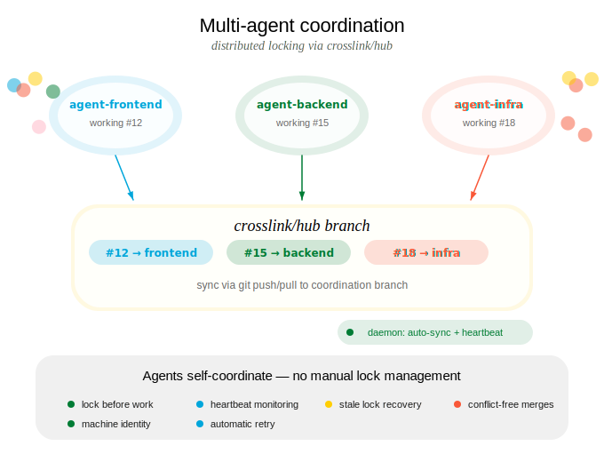

## tl;dr

Crosslink lets you tell your agent to work on multiple features at once. Behind the scenes, agents self-coordinate through distributed locking so they never step on each other. You describe the work; the agents sort out who does what.

## How It Works

Lock state is stored on a `crosslink/hub` git branch and synchronized via git. Each agent registers a machine-local identity and claims issues through locks. Other agents see which issues are taken and work on available ones instead. All of this happens automatically -- you never need to manage locks yourself.



<!--  -->


## Agent Registration

::: {.columns}
::: {.column width="35%"}
**You say / do:**

> "Work on these three features in parallel."

You describe the features. The agent (or agents) each register unique identities before starting work.
:::
::: {.column width="5%"}
:::
::: {.column width="60%"}
**Agent executes:**

```bash
crosslink agent init agent-frontend -d "Frontend specialist"
crosslink agent init agent-backend -d "API work"
crosslink agent init agent-infra -d "Infrastructure"
```
:::
:::

## Lock Coordination

::: {.columns}
::: {.column width="35%"}
**You say / do:**

> "Go ahead, all three of you."

You launch multiple agents. Each one automatically claims its issue via a distributed lock. No two agents will work on the same issue.
:::
::: {.column width="5%"}
:::
::: {.column width="60%"}
**Agent executes:**

```bash
# Each agent automatically locks its issue
crosslink session work 12   # agent-frontend claims #12
crosslink session work 15   # agent-backend claims #15
crosslink session work 18   # agent-infra claims #18

# If an agent tries a locked issue, it moves on
crosslink issue next        # skips locked issues
```
:::
:::

### Lock-Aware Commands

These commands automatically respect lock state -- no manual lock management required:

| Command | Lock Behavior |
|---------|---------------|
| `crosslink issue next` | Skips locked issues when recommending work |
| `crosslink session work <id>` | Warns if issue is locked by another agent |
| `crosslink create --work` | Only sets as active if not locked |

## Daemon Operation

::: {.columns}
::: {.column width="35%"}
**You say / do:**

> "Keep everything in sync while the agents work."

The daemon runs in the background, pushing heartbeats and flushing state so agents stay coordinated without any manual intervention.
:::
::: {.column width="5%"}
:::
::: {.column width="60%"}
**Agent executes:**

```bash
crosslink daemon start    # background process
crosslink daemon status   # verify it's running
```

The daemon auto-flushes session state every 30s, pushes heartbeats every 2.5 min, and detects stale locks from dead agents.
:::
:::

## Coordination Branch

Lock state lives on the `crosslink/hub` branch, separate from your code branches. The branch contains:

- Lock files (one per locked issue)
- Agent heartbeat timestamps
- GPG/SSH signatures for integrity verification

Agents push to this branch when claiming/releasing locks and pull from it during `crosslink sync`.

## Signature Verification

Crosslink supports SSH signature verification for the coordination branch to ensure lock state comes from trusted agents.

::: {.columns}
::: {.column width="35%"}
**You say / do:**

> "Make sure only our agents can modify coordination state."

You set up trust once, and all subsequent sync operations verify signatures automatically.
:::
::: {.column width="5%"}
:::
::: {.column width="60%"}
**Agent executes:**

```bash
# Each agent generates a signing key on init
crosslink agent init my-agent-1

# Approve trusted agents
crosslink trust approve my-agent-1
crosslink trust list

# Sync with automatic verification
crosslink sync
```
:::
:::

## Launching Agents

### Kickoff (Single Agent)

Launch a single background agent to implement a feature:

```bash
crosslink kickoff run "add batch retry logic"
crosslink kickoff run "add retry logic" --container docker  # in a container
```

See [Kickoff](kickoff.qmd) for the full guide.

### Swarm (Multi-Agent Phased Builds)

Coordinate multiple agents across phases from a design document:

```bash
crosslink swarm init --doc DESIGN.md
crosslink swarm launch 1
```

See [Swarm Orchestration](swarm.qmd) for the full guide.

### Container Execution

Run agents in isolated Docker containers instead of tmux:

```bash
crosslink kickoff run "my feature" --container docker
```

See [Container-Based Agents](container-agents.qmd) for the full guide.
