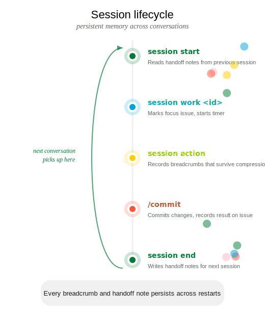

::: {.guide-card}
{.card-icon}

## tl;dr

Sessions are crosslink's memory system. Your agents use them automatically to preserve context across conversations — tracking what's being worked on, recording breadcrumbs, and passing handoff notes to the next session.
:::

&nbsp;

## The session lifecycle

Every agent conversation follows this cycle. The hooks handle most of it automatically — you just provide direction.

::: {.column-screen .center}
{width="750px"}
:::


<!-- ```
session start → session work <id> → session action "..." → session end --notes "..."
     ↑                                                              ↓
     └──────────────── next session reads handoff notes ────────────┘
``` -->


### Starting a session

::: {.columns}
::: {.column width="35%"}
**You start a new conversation:**

The agent's `session-start` hook fires automatically, showing handoff notes from the previous session, cleaning up stale sessions, and displaying open issues.

Your agent picks up exactly where the last one left off.
:::
::: {.column width="5%"}
→
:::
::: {.column width="60%"}
**Agent executes:**

```bash
# Hook fires automatically on session start
crosslink session start
# Output:
# Previous handoff: "Fixed auth bug #3.
#   Dark mode (#2) is next priority."
# Open issues: #2 (high), #5 (medium)
```
:::
:::

### Setting focus

::: {.columns}
::: {.column width="35%"}
**You say:**

> "Work on the dark mode feature"

The agent finds the matching issue and claims it as its active focus. The work-check hook uses this to track which issue is active — all subsequent code changes are attributed to this issue.
:::
::: {.column width="5%"}
→
:::
::: {.column width="60%"}
**Agent executes:**

```bash
crosslink session work 2
# Output: Now working on: #2 Add dark mode toggle
```

Or if no issue exists yet:

```bash
crosslink quick "Add dark mode toggle" -p high -l feature
# Creates issue AND sets it as focus in one step
```
:::
:::

### Recording breadcrumbs

::: {.columns}
::: {.column width="35%"}
**While working**, the agent periodically records what it's doing. These breadcrumbs survive context compression — when the AI's context window fills up and resets, the session hook restores the last breadcrumb so the agent knows where it left off.
:::
::: {.column width="5%"}
→
:::
::: {.column width="60%"}
**Agent executes:**

```bash
crosslink session action "Found theme toggle in settings.tsx, \
  implementing CSS variable approach"
```

```bash
crosslink session action "Dark mode CSS done, writing tests"
```
:::
:::

### Ending a session

::: {.columns}
::: {.column width="35%"}
**You say:**

> "That's good for now, let's wrap up"

The agent writes handoff notes summarizing what was done, what's in progress, and what's next — as if briefing a colleague taking over.
:::
::: {.column width="5%"}
→
:::
::: {.column width="60%"}
**Agent executes:**

```bash
crosslink session end --notes "Implemented dark mode \
  toggle in settings.tsx. CSS variables working, tests \
  passing. Still need: system preference detection and \
  persistence to localStorage. Issue #5 is next."
```
:::
:::

### Checking status

::: {.columns}
::: {.column width="35%"}
**You ask:**

> "What are you working on?"
:::
::: {.column width="5%"}
→
:::
::: {.column width="60%"}
**Agent executes:**

```bash
crosslink session status
# Session #12 (started 2026-03-11 14:30)
# Working on: #2 Add dark mode toggle
# Duration: 23 minutes
```
:::
:::

 

---

## Extra features

### Stale session detection

Sessions idle for more than 4 hours are automatically ended on the next `session start`. This prevents "ghost sessions" from accumulating when an agent session is abandoned without a clean end. The auto-end message notes that handoff notes may be incomplete.

### Context compression recovery

When Claude Code's context window fills up, it compresses earlier messages. The `session-start.py` hook fires on resume and:

1. Detects the active session is still running (resume vs. fresh start)
2. Adds an auto-comment on the active issue noting the compression event
3. Injects the last recorded `session action` as a breadcrumb
4. Displays current session state

This happens transparently — the agent recovers and continues working without losing track of what it was doing.

 

---

## Tips

- **Agents handle sessions automatically.** The hooks manage start, focus, breadcrumbs, and end — you just provide high-level direction.
- **Write handoff notes for your future self.** Be specific about what's done, what's in progress, and what's next.
- **Breadcrumbs are insurance.** `session action` is your safeguard against context loss — agents record them frequently during complex work.
- **`crosslink quick` is the fast path.** Creates an issue, labels it, and sets focus in one command.
