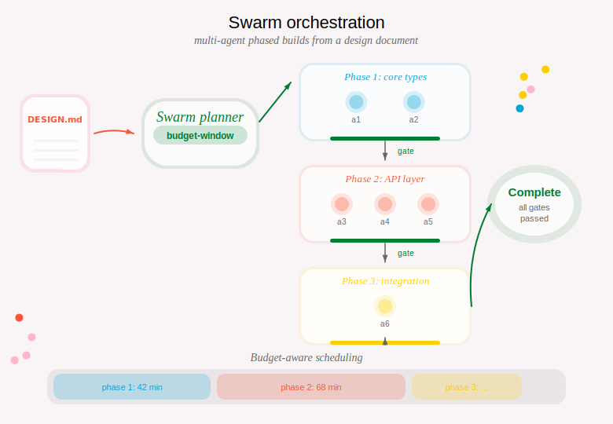

&nbsp;

::: {.feature-card}
## tl;dr

Swarm orchestration lets you build a complex feature across multiple phases. You hand the system a design document and a budget, and the swarm decomposes it into phases, launches agents, gates quality between phases, and manages spending -- all automatically.
:::

&nbsp;

---

## Overview

::: {.column-page-right}

:::

```
"Build this auth system from my design doc."
    |
    +-- swarm init --doc DESIGN.md
    |       |
    |       +-- Phase 1: Foundation
    |       |     +-- Agent A (data layer)
    |       |     +-- Agent B (config parsing)
    |       |
    |       +-- Phase 2: Core Logic
    |       |     +-- Agent C (business rules)
    |       |     +-- Agent D (API endpoints)
    |       |
    |       +-- Phase 3: Integration
    |             +-- Agent E (end-to-end wiring)
    |
    +-- swarm launch 1        <- launch Phase 1 agents
    +-- swarm gate 1          <- run test suite as quality gate
    +-- swarm checkpoint 1    <- record progress
    +-- swarm launch 2        <- advance to Phase 2
    +-- ...
```

&nbsp;

---

## Initializing a swarm

::: {.columns}
::: {.column width="35%"}
**You say / do:**

> "Build this feature across multiple phases. Here's my design doc."

You provide a design document describing the feature. The swarm decomposes it into phases and work units automatically.
:::
::: {.column width="5%"}
→
:::
::: {.column width="60%"}
**Agent executes:**

```bash
crosslink swarm init --doc DESIGN-AUTH-SYSTEM.md
crosslink swarm plan-show
```

Parses the document, creates a phased plan, and stores it on the `crosslink/hub` branch so all agents can see it.
:::
:::

&nbsp;

---

## Planning with budget awareness

::: {.columns}
::: {.column width="35%"}
**You say / do:**

> "I have a 3-hour budget window. Schedule the phases to fit."

You set a budget and the swarm figures out how to distribute phases across your available time. Cost estimates improve with each completed phase.
:::
::: {.column width="5%"}
→
:::
::: {.column width="60%"}
**Agent executes:**

```bash
crosslink swarm plan --budget-window 3h
crosslink swarm config --budget-window 3h --model opus
crosslink swarm estimate 1
```

Plans phase scheduling, configures the cost model, and estimates wall-clock cost for the first phase.
:::
:::

&nbsp;

---

## Launching a phase

::: {.columns}
::: {.column width="35%"}
**You say / do:**

> "Launch phase 1."

Each agent in the phase gets its own worktree, branch, crosslink issue, and agent identity. They run in parallel, coordinated through distributed locks.
:::
::: {.column width="5%"}
→
:::
::: {.column width="60%"}
**Agent executes:**

```bash
crosslink swarm launch 1
crosslink swarm status
```

Launches all agents for phase 1 and shows progress.
:::
:::

::: {.columns}
::: {.column width="35%"}
**You say / do:**

> "Launch phase 2 -- but only if I have budget left."

Budget-aware launch checks remaining budget before starting. If the estimated cost exceeds your window, the launch is blocked with a warning.
:::
::: {.column width="5%"}
→
:::
::: {.column width="60%"}
**Agent executes:**

```bash
crosslink swarm launch 2 --budget-aware
```
:::
:::

&nbsp;

---

## Phase gates

::: {.columns}
::: {.column width="35%"}
**You say / do:**

> "Run the quality gate for phase 1."

The gate runs the project's full test suite. All tests must pass before the phase is considered complete and you can advance.
:::
::: {.column width="5%"}
→
:::
::: {.column width="60%"}
**Agent executes:**

```bash
crosslink swarm gate 1
```

Runs the test suite. Reports pass/fail and any failures.
:::
:::

&nbsp;

---

## Checkpointing

::: {.columns}
::: {.column width="35%"}
**You say / do:**

> "Phase 1 looks good. Record it and move on."

Checkpointing records timing data, agent results, and handoff notes. This is what `resume` reads if you come back later.
:::
::: {.column width="5%"}
→
:::
::: {.column width="60%"}
**Agent executes:**

```bash
crosslink swarm checkpoint 1 \
  --notes "Auth models and DB migrations done"
```

Records phase completion on the hub branch.
:::
:::

Use `--force` to checkpoint even if the gate hasn't passed (for partial progress):

```bash
crosslink swarm checkpoint 1 --force --notes "3 of 4 agents complete, one blocked"
```

&nbsp;

---

## Resuming after interruption

::: {.columns}
::: {.column width="35%"}
**You say / do:**

> "I'm back. Where did we leave off?"

Resume reconstructs swarm state from the hub branch and tells you exactly what to do next.
:::
::: {.column width="5%"}
→
:::
::: {.column width="60%"}
**Agent executes:**

```bash
crosslink swarm resume
```

Reads checkpoints, lock state, heartbeats, and budget to show: which phases are done, which agents are still running, and which phases are ready to launch.
:::
:::

&nbsp;

---

## Harvesting cost data

After agents finish, harvest cost data to improve future estimates:

```bash
crosslink swarm harvest
```

Scans completed agents and updates the cost history. The more phases you complete, the more accurate future `estimate` calls become.

&nbsp;

---

## Full workflow example

```bash
# 1. Initialize from a design document
crosslink swarm init --doc DESIGN-AUTH-SYSTEM.md

# 2. Review the plan
crosslink swarm plan-show

# 3. Launch phase 1
crosslink swarm launch 1

# 4. Monitor agents
crosslink swarm status

# 5. Once agents complete, run the gate
crosslink swarm gate 1

# 6. Checkpoint and advance
crosslink swarm checkpoint 1 --notes "Auth models and DB migrations done"

# 7. Launch phase 2
crosslink swarm launch 2

# 8. If interrupted, resume later
crosslink swarm resume
```

&nbsp;

---

## Command reference

| Command | Description |
|---------|-------------|
| `swarm init --doc <PATH>` | Initialize a swarm plan from a design document |
| `swarm status` | Show current swarm state and progress |
| `swarm plan [--budget-window <DUR>]` | Plan multi-phase build across budget windows |
| `swarm plan-show` | Display the current window plan |
| `swarm launch <phase>` | Launch all agents for a phase |
| `swarm launch <phase> --budget-aware` | Launch with budget check |
| `swarm gate <phase>` | Run test suite as a phase gate |
| `swarm checkpoint <phase>` | Record phase completion |
| `swarm estimate <phase>` | Estimate wall-clock cost for a phase |
| `swarm harvest` | Update cost history from completed agents |
| `swarm resume` | Reconstruct state after interruption |
| `swarm config --budget-window <DUR> --model <MODEL>` | Configure budget parameters |

&nbsp;

---

## See also

- [Kickoff](kickoff.qmd) for launching individual agents
- [Multi-Agent Coordination](multi-agent.qmd) for distributed locking
